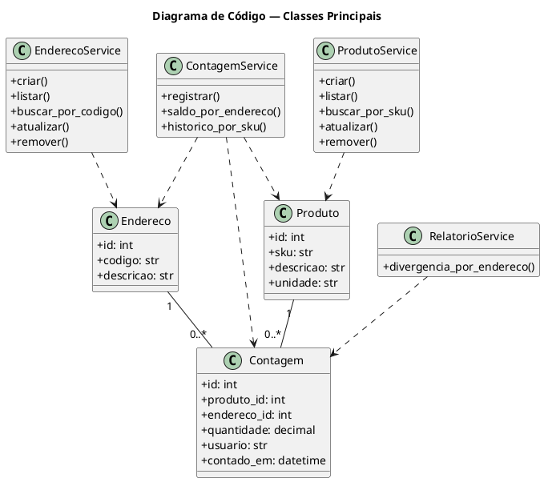

# Documentação Geral do Sistema — Controle de Estoque por Endereços

## 1. Nível 1 — Contexto do Sistema

O sistema é uma aplicação web para controle de estoque por endereços de armazém, permitindo cadastrar produtos, endereços e contagens, além de consultar saldo atual e divergência entre contagens. Ele é usado principalmente por operadores de estoque e gestores, que acessam a interface web para registrar informações e analisar os dados. O sistema se integra ao SQL Server, onde ficam persistidos produtos, endereços e contagens.

```plantuml
@startuml C4_Context
!include https://raw.githubusercontent.com/plantuml-stdlib/C4-PlantUML/master/C4_Context.puml

LAYOUT_WITH_LEGEND()
title Diagrama de Contexto — Controle de Estoque por Endereços

Person(operador, "Operador de Estoque", "Registra contagens e mantém os cadastros básicos.")
Person(gestor, "Gestor de Armazém", "Consulta saldo e relatório de divergência.")

System(sistema, "Controle de Estoque por Endereços", "Aplicação web para controle de produtos, endereços e contagens.")

System_Ext(sqlserver, "SQL Server", "Banco relacional usado para persistência.")

Rel(operador, sistema, "Usa via navegador")
Rel(gestor, sistema, "Usa via navegador")
Rel(sistema, sqlserver, "Lê e grava dados", "SQL / ORM")
@enduml
```

## 2. Nível 2 — Containers

A solução é organizada em três containers principais: a interface web, a API REST e o banco de dados. A interface web é feita em Flask com Jinja2 e consome a API para listar, cadastrar e editar dados. A API centraliza as regras de negócio e expõe os endpoints JSON, enquanto o SQL Server armazena os dados de forma relacional.

```plantuml
@startuml C4_Containers
!include https://raw.githubusercontent.com/plantuml-stdlib/C4-PlantUML/master/C4_Container.puml

LAYOUT_WITH_LEGEND()
title Diagrama de Containers — Controle de Estoque por Endereços

Person(operador, "Operador de Estoque")
Person(gestor, "Gestor de Armazém")

System_Boundary(sistema, "Controle de Estoque por Endereços") {
    Container(web, "Interface Web", "Flask + Jinja2 + HTML/CSS/JS", "Telas para cadastro, edição, saldo e divergência.")
    Container(api, "API REST", "Flask (JSON)", "Expõe endpoints para produtos, endereços, contagens e relatórios.")
    ContainerDb(db, "Banco de Dados", "SQL Server", "Armazena os dados do domínio.")
}

Rel(operador, web, "Acessa via navegador")
Rel(gestor, web, "Acessa via navegador")
Rel(web, api, "Consome endpoints JSON", "HTTP")
Rel(api, db, "Executa consultas e gravações", "SQL / ORM")
@enduml
```

## 3. Nível 3 — Componentes

Dentro da aplicação Flask, a estrutura é separada por responsabilidades. Existem blueprints para API e para Web, services para as regras de negócio e models para o acesso ao banco. O relatório de divergência usa uma consulta em SQL puro para atender ao requisito técnico e facilitar o cálculo das duas últimas contagens por endereço.

```plantuml
@startuml C4_Components
!include https://raw.githubusercontent.com/plantuml-stdlib/C4-PlantUML/master/C4_Component.puml

LAYOUT_WITH_LEGEND()
title Diagrama de Componentes — Aplicação Flask

Container_Boundary(app, "Aplicação Flask") {
    Component(bp_api_produtos, "Blueprint API Produtos", "Flask Blueprint", "CRUD de produtos.")
    Component(bp_api_enderecos, "Blueprint API Endereços", "Flask Blueprint", "CRUD de endereços.")
    Component(bp_api_contagens, "Blueprint API Contagens", "Flask Blueprint", "Registro de contagem, saldo e histórico.")
    Component(bp_api_relatorio, "Blueprint API Relatório", "Flask Blueprint", "Relatório de divergência.")

    Component(bp_web_produtos, "Blueprint Web Produtos", "Flask Blueprint + Jinja2", "Listagem, cadastro e edição de produtos.")
    Component(bp_web_enderecos, "Blueprint Web Endereços", "Flask Blueprint + Jinja2", "Listagem, cadastro e edição de endereços.")
    Component(bp_web_contagens, "Blueprint Web Contagens", "Flask Blueprint + Jinja2", "Formulário de registro de contagem e saldo.")
    Component(bp_web_relatorio, "Blueprint Web Relatório", "Flask Blueprint + Jinja2", "Tela de divergência com destaque visual.")

    Component(svc_produtos, "ProdutoService", "Python", "Validações e regras de produto.")
    Component(svc_enderecos, "EnderecoService", "Python", "Validações e regras de endereço.")
    Component(svc_contagens, "ContagemService", "Python", "Valida quantidade, resolve referências e grava contagens.")
    Component(svc_relatorio, "RelatorioService", "Python", "Executa SQL puro para divergência.")

    Component(models, "Models ORM", "SQLAlchemy", "Mapeamento das entidades Produto, Endereco e Contagem.")
    Component(errors, "Error Handler", "Flask", "Tratamento centralizado de erros.")
}

Rel(bp_api_produtos, svc_produtos, "Usa")
Rel(bp_api_enderecos, svc_enderecos, "Usa")
Rel(bp_api_contagens, svc_contagens, "Usa")
Rel(bp_api_relatorio, svc_relatorio, "Usa")

Rel(bp_web_produtos, bp_api_produtos, "Consome")
Rel(bp_web_enderecos, bp_api_enderecos, "Consome")
Rel(bp_web_contagens, bp_api_contagens, "Consome")
Rel(bp_web_relatorio, bp_api_relatorio, "Consome")

Rel(svc_produtos, models, "Consulta")
Rel(svc_enderecos, models, "Consulta")
Rel(svc_contagens, models, "Consulta e grava")
Rel(svc_relatorio, models, "Consulta com SQL puro")
@enduml
```

## 4. Nível 4 — Código

No nível de código, o domínio é representado por três entidades principais: Produto, Endereco e Contagem. Produto e Endereco têm identificadores únicos, enquanto Contagem registra a quantidade, o usuário e a data/hora da leitura. Sobre essas entidades, a camada de serviços concentra as regras de negócio, como validação de unicidade, proibição de quantidade negativa e cálculo de saldo e divergência.


