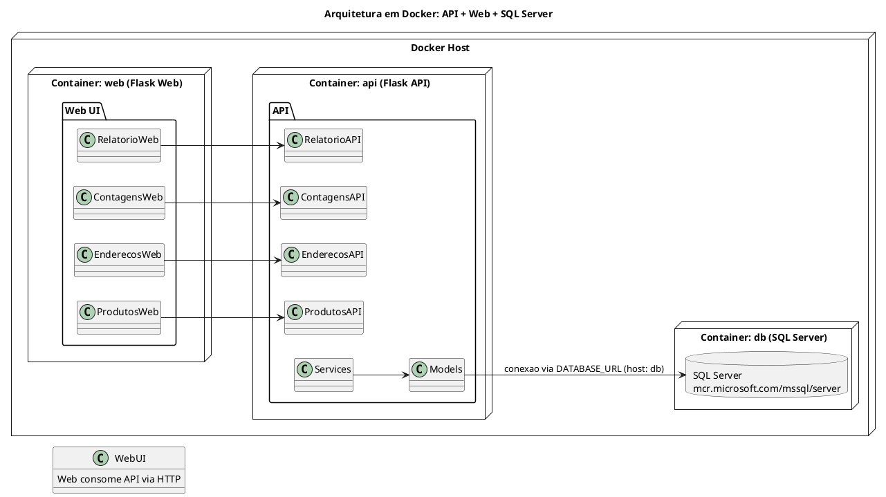

# Plano de Ação — Controle de Estoque por Endereços

## Flask API + Flask Web + SQL Server (Docker Compose)

## Tempo total estimado: 10 horas

---

## Etapa 1 — Estrutura do Projeto, Arquitetura e Docker básico (≈ 2 horas)

Objetivo: definir a arquitetura, separar API e Web em módulos, preparar Dockerfiles e o esqueleto do projeto.

### Tarefas

- Criar repositório Git e `.gitignore`:
  - Ignorar `venv`, `__pycache__`, `.env`, `sqlserver_data`, dumps, arquivos de banco local.
- Estrutura de diretórios:
  - `api/` — aplicação Flask apenas com API REST.
    - `api/app/__init__.py` (`create_app()`).
    - `api/app/config.py`.
    - `api/app/models/`, `api/app/services/`, `api/app/api/`.
  - `web/` — aplicação Flask (ou outra) apenas para interface Web.
    - `web/app/__init__.py`.
    - `web/app/config.py`.
    - `web/app/web/`, `web/templates/`, `web/static/`.
  - `sql/` — scripts SQL (ex.: `divergencia.sql`).
  - `seed.py` — script de seed rodando via API (ou direto nos models).
- `requirements.txt` separados ou um único compartilhado (decisão sua, documentada):
  - Mínimo: `Flask`, `Flask-SQLAlchemy`/`SQLAlchemy`, `pyodbc`, `python-dotenv`.
- `.env.example` na raiz:
  - `SA_PASSWORD`, `SECRET_KEY_API`, `SECRET_KEY_WEB`, `DATABASE_URL_API` etc.
- Criar **Dockerfile** para API (`Dockerfile.api`):
  - Base `python:3.10-slim`.
  - Copiar código da pasta `api`.
  - Instalar dependências.
  - `CMD` usando `flask run` ou `gunicorn` expondo porta (ex.: `8000`).
- Criar **Dockerfile** para Web (`Dockerfile.web`):
  - Base `python:3.10-slim`.
  - Copiar código da pasta `web`.
  - Instalar dependências.
  - `CMD` usando `flask run` na porta (ex.: `5000`).
- Commit: `chore: estrutura inicial api/web e Dockerfiles`.

---

## Etapa 2 — SQL Server em Docker, Models e Seed (≈ 2–3 horas)

Objetivo: subir SQL Server via Docker Compose junto com a API, modelar o domínio e criar dados de teste.

### Tarefas

- Criar **docker-compose.yml** com três serviços: `api`, `web`, `db`.

```yaml
version: "3.9"

services:
  db:
    image: mcr.microsoft.com/mssql/server:2022-latest
    container_name: estoque-sqlserver
    ports:
      - "1433:1433"
    environment:
      SA_PASSWORD: "${SA_PASSWORD}"
      ACCEPT_EULA: "Y"
      MSSQL_PID: "Developer"
    volumes:
      - sqlserver_data:/var/opt/mssql

  api:
    build:
      context: ./api
      dockerfile: Dockerfile.api
    container_name: estoque-api
    ports:
      - "8000:8000"
    environment:
      FLASK_ENV: "development"
      FLASK_APP: "wsgi.py"
      DATABASE_URL: "mssql+pyodbc://sa:${SA_PASSWORD}@db:1433/estoque?driver=ODBC+Driver+17+for+SQL+Server"
      SECRET_KEY: "${SECRET_KEY_API}"
    depends_on:
      - db

  web:
    build:
      context: ./web
      dockerfile: Dockerfile.web
    container_name: estoque-web
    ports:
      - "5000:5000"
    environment:
      FLASK_ENV: "development"
      FLASK_APP: "wsgi.py"
      API_BASE_URL: "http://api:8000"
      SECRET_KEY: "${SECRET_KEY_WEB}"
    depends_on:
      - api

volumes:
  sqlserver_data:
```

- Subir tudo com `docker-compose up --build`:
  - SQL Server (`db`) sobe junto com a API (`api`) — `depends_on: db`.
- Implementar models na API (`Produto`, `Endereco`, `Contagem`) usando SQLAlchemy.
- Implementar criação de schema (ex.: `api/app/db_init.py` com `create_all()`).
- Planejar índices para saldo e divergência.
- Implementar `seed.py` (rodando contra API ou usando models diretamente):
  - 10 produtos, 5 endereços, 30 contagens em datas diferentes.
- Commits: `feat: docker-compose com api/web/db`, `feat: models e schema na API`, `feat: seed de dados`.

---

## Etapa 3 — API REST (CRUD, Contagens, Relatórios) (≈ 3–4 horas)

Objetivo: completar a API em cima do SQL Server containerizado, com regras de negócio e SQL puro.

### Tarefas

- Na aplicação da **API**:
  - Blueprints:
    - `/api/produtos`: CRUD com paginação, busca por SKU.
    - `/api/enderecos`: CRUD completo.
    - `/api/contagens`: registro de contagem, saldo por endereço, histórico por SKU.
    - `/api/relatorios`: relatório de divergência.
  - Regras:
    - Validar unicidade de SKU e código de endereço.
    - Não permitir quantidade negativa.
    - Validar existência de produto/endereço no registro de contagem.
  - Endpoints:
    - Saldo atual por endereço (contagem mais recente por produto).
    - Histórico de contagens por SKU (ordenado por data, filtro de intervalo).
    - Relatório de divergência:
      - Diferença entre duas últimas contagens por produto.
      - Classificação aumento/redução/estável/sem histórico.
      - Implementado com **SQL puro** (`session.execute` + arquivo `sql/divergencia.sql` documentado).
  - Tratamento centralizado de erros:
    - `400`, `404`, `409`, `422`, `500` com JSON descritivo.
- Testar tudo com `docker-compose`:
  - API acessível em `http://localhost:8000/api/...`.
  - Conexão com SQL Server funcionando via host `db` (nome do serviço) [web:42][web:47].
- Commits: `feat: API CRUD`, `feat: contagens, saldo e histórico`, `feat: relatório divergência (SQL puro) e error handler`.

---

## Etapa 4 — Interface Web, Integração com API e README (≈ 2–3 horas)

Objetivo: construir a interface Web consumindo a API, documentar o deploy com Docker Compose e finalizar.

### Tarefas

- Na aplicação **Web**:
  - Blueprints Web:
    - Produtos: listar, cadastrar, editar.
    - Endereços: listar, cadastrar, editar.
    - Contagens: formulário de registro, tela de saldo por endereço.
    - Relatório de divergência: seleção de endereço e exibição de resultados com destaque visual.
  - Consumo da API:
    - Usar `API_BASE_URL` (ex.: `http://api:8000`) via variáveis de ambiente.
    - Fazer requisições HTTP para os endpoints da API (server-side com `requests` ou via JS `fetch`).
- `README.md` (Docker-first):
  - Pré-requisitos: Docker, Docker Compose.
  - Passo a passo:
    1. Copiar `.env.example` para `.env` e definir `SA_PASSWORD`, `SECRET_KEY_API`, `SECRET_KEY_WEB`.
    2. Rodar `docker-compose up --build`.
    3. Executar `db_init` e `seed` dentro do container `api`.
    4. Acessar Web em `http://localhost:5000`, API em `http://localhost:8000`.
  - Resumo da arquitetura:
    - Três containers: `api`, `web`, `db`.
    - SQL Server sobe junto com Docker Compose e é usado pela API.
    - Web consome API via HTTP/JSON.
  - Decisões de arquitetura, trade-offs e melhorias futuras.
- Bônus (se sobrar tempo):
  - Importação de CSV de contagens.
  - Autenticação simples (login) protegendo endpoints/telas de escrita.
- Commits finais: `feat: interface web integrada com API`, `docs: README com instruções de docker-compose`, `refactor: ajustes finais`.

---

## Diagrama UML — visão geral em containers (API, Web, DB)


